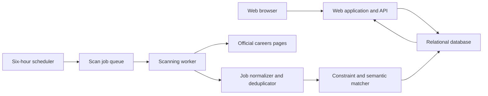

# Referral Job Monitor — Product and Technical Specification

## 1. Document status

This document captures the product decisions made during the initial design discussion. It is intended to be the starting point for implementation.

Items under **Locked decisions** were explicitly agreed upon. Items under **Recommended implementation** are concrete starting choices that can be changed without altering the product definition. Items under **Open decisions** still need to be resolved.

## 2. Problem statement

During a job search, a candidate may build relationships with employees at several companies. Some contacts offer to provide a referral when a suitable position appears. The candidate must then repeatedly visit every company's official careers page, search through its openings, decide which ones fit, and remember which contact belongs to that company.

This process is repetitive and easy to neglect. A relevant opportunity may be missed even though a willing referral contact already exists.

The product will monitor selected official company careers pages, detect new and changed openings, compare them with the candidate's resume and stated preferences, and present relevant roles in a web-based feed.

## 3. Product goal

The system should answer one question reliably:

> Have any relevant jobs appeared on the official careers pages of companies where I may have a referral contact?

The first release is a personal, single-user product. Its design should avoid unnecessary obstacles to multi-user support later, but multi-user behavior is not part of the initial scope.

### Core promise

Within approximately six hours of a role appearing on a monitored official careers page, the application should:

1. Discover and store the role.
2. Determine whether it is a strong match, possible match, or irrelevant.
3. Explain the important reasons for the classification.
4. Show the role in the appropriate section of the web application.
5. Show the referral contacts stored for that company.

The system must never silently treat a failed scan as proof that no new jobs exist.

## 4. Locked product decisions

### 4.1 Initial audience

- The MVP is for one user.
- It is a personal tool first and a potential multi-user product later.
- One active search profile is supported.
- The active profile may contain multiple target and adjacent roles.

### 4.2 Product interface

- The product is a proper hosted web application.
- Monitoring runs on hosted infrastructure and does not depend on the user's computer being awake.
- There is no user-facing CLI.
- There is no local background-service mode.
- There are no email, browser-push, SMS, or mobile notifications in the MVP.
- The user opens the web application to inspect new matches and system status.

### 4.3 Scan schedule

- Every active company is scanned every six hours.
- Adding a company triggers an immediate validation and test scan.
- A manual **Scan now** action should be available.
- Scan work runs independently of the web interface.

### 4.4 Official source policy

- The company's official careers page is the only source of truth.
- External job boards, aggregators, and search engines are not used as fallback sources.
- In the MVP, one company has exactly one official careers-page URL.
- Every configured source must visibly show whether it is healthy, failing, or awaiting setup.

### 4.5 Source compatibility

The long-term product goal is to handle any official careers page. This does not imply that every possible page can be extracted automatically on day one.

The source-handling hierarchy is:

1. Reusable connector for a known ATS or portal type.
2. Extraction from standard structured data such as `JobPosting` JSON-LD.
3. Configurable extraction from ordinary HTML.
4. Configurable extraction using a rendered browser for JavaScript-heavy sites.
5. A custom connector for a company or unusual site family as a last resort.

Logic should be reused by platform or page pattern whenever possible. Company-specific configuration is preferred over company-specific application code.

Some pages may remain inaccessible because of authentication, CAPTCHAs, bot protection, technical failures, or applicable site restrictions. These sources must be marked as requiring intervention rather than being silently skipped.

### 4.6 Adding a company

The onboarding flow is:

1. The user enters the company name and official careers-page URL.
2. The system automatically detects the platform or extraction method.
3. The system performs a test scan.
4. The UI previews the detected method, total job count, and sample jobs.
5. The user confirms the company before monitoring begins.
6. If extraction fails, the company is retained with a visible **Setup required** state and failure reason.

The user should not need to know which ATS or extraction strategy a page uses.

### 4.7 First scan behavior

- The initial scan imports and matches all currently open jobs.
- Those jobs are labeled **Existing when monitoring began**.
- They must not be misrepresented as newly posted jobs.
- Jobs first discovered in later scans receive their actual discovery timestamp and a **New** state.

### 4.8 Job lifecycle

- A change to relevant job content updates the stored job and triggers matching again.
- Relevant fields include title, description, location, and requirements.
- A job missing from one successful scan is marked **Possibly closed**.
- A job missing from two consecutive successful scans is marked **Closed**.
- A failed scan never counts as evidence that a job closed.
- Closed jobs remain in history and are not deleted.

### 4.9 Candidate context

- The user uploads one PDF resume.
- Resume text is extracted and stored for matching.
- Extracted text is visible and editable so parsing errors can be corrected.
- Updating the resume or preferences re-runs matching for active jobs.
- Explicit preferences take precedence over conclusions inferred from the resume.

### 4.10 Matching behavior

Matching combines deterministic constraints with semantic relevance.

- Exact title keywords are not sufficient. For example, `AI Engineer` and `Artificial Intelligence Engineer` should be understood as related roles.
- Explicit non-negotiable constraints are applied before semantic scoring.
- Remaining roles are compared with target roles, adjacent roles, preferences, resume skills, experience, and domain background.
- The matcher is moderately recall-oriented: missing a good opportunity is considered worse than showing a few extra possibilities.
- Results are classified as **Strong match**, **Possible match**, or **Irrelevant**.
- Strong matches appear first in the feed.
- Possible matches remain visible in their own section.
- Irrelevant roles remain hidden by default but inspectable.
- The UI should explain important supporting evidence and important gaps.

The exact structure of hard constraints versus soft preferences is still an open decision; see Section 14.

### 4.11 Referral contacts

Each company may contain simple referral-contact records with:

- Name
- Contact link
- Notes

Contacts are displayed with matching roles from their company. The MVP does not generate messages, send outreach, or attempt to become a full networking CRM.

### 4.12 Job review state

- The MVP stores **seen** and **dismissed** state for each job.
- Dismissed jobs are hidden from the default feed but remain inspectable and restorable.
- A separate saved-job shortlist is intentionally excluded from the MVP.

## 5. Primary user workflows

### 5.1 Initial setup

1. Open the profile page.
2. Upload a PDF resume.
3. Review and correct the extracted text.
4. Enter target roles and other job preferences.
5. Save the active profile.
6. Add the first company and validate its careers page.
7. Review matched jobs imported by the initial scan.

### 5.2 Add a monitored company

1. Enter the company name and official URL.
2. Start automatic detection.
3. See detection progress and any errors.
4. Review the extraction preview.
5. Confirm monitoring.
6. Optionally add one or more referral contacts.

### 5.3 Review opportunities

1. Open the dashboard.
2. See counts for unseen strong and possible matches.
3. Open a role and inspect its match explanation.
4. Open the official posting in a new tab.
5. View the referral contacts for the company.
6. Dismiss or mark the role as viewed.

### 5.4 Diagnose monitoring

1. Open the companies page.
2. See the last successful scan, next scheduled scan, detected connector, and current health for every company.
3. Open a failure to see a useful error message.
4. Trigger a manual scan after resolving the problem.

## 6. Recommended web application views

### Dashboard

- Unseen strong-match count
- Unseen possible-match count
- Strong matches ordered by discovery time and score
- Possible matches in a separate section
- Companies with scan failures or setup-required status
- Recent scan activity

### Job feed

- Filters for match class, company, lifecycle status, seen state, and saved/dismissed state
- Search by title, company, location, or skill
- Clear labels for new versus initially imported jobs
- Link to the official posting

### Job detail

- Normalized job information
- Official source URL
- Discovery and posted dates when available
- Match classification and score
- Match evidence and gaps
- Current lifecycle status
- Company referral contacts

### Companies

- Company name and official careers URL
- Connector/extraction method
- Last attempt and last successful scan
- Next scheduled scan
- Current health and most recent error
- Current open-job count
- **Scan now**, edit, pause, and remove actions

### Company detail

- Source configuration and health history
- Current and closed jobs
- Referral contacts
- Recent scan runs

### Profile

- Resume upload
- Extracted resume text editor
- Target and adjacent roles
- Structured preferences and constraints
- Last profile update and re-matching status

### History

- Closed, dismissed, and previously viewed jobs
- Filters and search

## 7. Recommended system architecture

Start with a modular monolith: one repository and one application codebase with clear module boundaries. The scanning worker may run as a separate process or deployment using the same codebase.



### Suggested modules

- `auth`: single-user authentication and session handling
- `profile`: resume ingestion and preferences
- `companies`: companies, official URLs, and contacts
- `connectors`: platform detection and job extraction
- `scans`: scheduling, queueing, retries, and scan history
- `jobs`: normalization, deduplication, versioning, and lifecycle
- `matching`: hard constraints, semantic scoring, classification, and explanations
- `feed`: job queries, seen state, saved state, and dismissals

Avoid separate microservices until scaling or isolation requirements make them necessary.

## 8. Connector architecture

### 8.1 Common contract

Every connector should satisfy a common interface similar to:

```ts
interface CareersConnector {
  validate(source: CareersSource): Promise<ValidationResult>;
  listJobs(source: CareersSource): Promise<RawJobSummary[]>;
  getJobDetails(job: RawJobSummary): Promise<RawJobDetails>;
}
```

If a platform's listing response already contains full descriptions, `getJobDetails` may be skipped or internally satisfied from the listing data.

### 8.2 Detection

Detection can use:

- URL hostname and path patterns
- HTML metadata and generator markers
- Known script URLs
- Structured JSON-LD
- Links and forms characteristic of an ATS
- The official page's own first-party data endpoints

Detection should return a confidence level and evidence. Low-confidence detection should not silently activate monitoring.

### 8.3 Connector levels

#### Known-platform connector

A connector is written once for Greenhouse, Lever, Ashby, Workday, or another recurring portal. Each company supplies only parameters such as tenant, board token, site identifier, or base URL.

#### Structured-data connector

A generic connector reads valid job metadata embedded in the page and follows pagination or job links within the official source.

#### Configurable HTML connector

The shared engine receives per-site extraction configuration, for example:

```yaml
listing_selector: ".job-card"
title_selector: ".job-title"
location_selector: ".job-location"
link_selector: "a"
next_page_selector: ".pagination-next"
```

Configuration should be versioned and validated against saved fixtures.

#### Rendered-browser connector

For JavaScript-heavy pages, a controlled browser renders the page before extraction. Prefer stable first-party data responses used by the page when they can be accessed appropriately and reliably.

#### Custom connector

Use custom code only when reusable platform logic and configuration are insufficient. If another site later shares the same pattern, promote the implementation into a reusable connector.

### 8.4 Connector testing and observability

- Store sanitized representative fixtures for supported source patterns when appropriate.
- Add contract tests for every connector.
- Record jobs discovered, jobs changed, pages visited, duration, and errors for each scan.
- Detect suspicious results, such as a source suddenly returning zero jobs.
- Never overwrite the last known-good result set after a failed extraction.

## 9. Recommended data model

The following is a starting model, not a locked choice of database schema.

### User

- `id`
- authentication fields
- timestamps

Only one user is active in the MVP, but ownership fields can prevent a painful multi-user migration later.

### SearchProfile

- `id`
- `user_id`
- `resume_file_key`
- `resume_extracted_text`
- `target_roles`
- `adjacent_roles`
- structured preferences
- `version`
- timestamps

Enforce one active profile per user.

### Company

- `id`
- `user_id`
- `name`
- `careers_url`
- `connector_type`
- `connector_config`
- `monitoring_status`
- `health_status`
- `last_scan_attempt_at`
- `last_successful_scan_at`
- `next_scan_at`
- `last_error`
- timestamps

The MVP enforces one careers URL per company.

### ReferralContact

- `id`
- `company_id`
- `name`
- `contact_url`
- `notes`
- timestamps

### ScanRun

- `id`
- `company_id`
- `trigger` (`initial`, `scheduled`, or `manual`)
- `status`
- connector version
- start and finish timestamps
- jobs found, created, updated, and missing
- error category and details

### Job

- `id`
- `company_id`
- connector-provided external ID when available
- canonical official URL
- title
- description
- location
- department
- employment type
- posted date when supplied by the source
- first discovered time
- last observed time
- initial-import flag
- content fingerprint
- lifecycle status
- consecutive successful absences
- raw-source payload or reference when appropriate
- timestamps

Use a stable external ID when available. Otherwise, use canonical URL plus carefully selected identifying fields. Content fingerprints detect meaningful edits but should not be the sole job identity.

### JobVersion

- `id`
- `job_id`
- content fingerprint
- normalized snapshot or changed fields
- observed time

This can be deferred if full version history is unnecessary for the first implementation, but the current fingerprint should exist from the start.

### MatchResult

- `id`
- `job_id`
- `search_profile_id`
- profile version
- match class
- overall score
- hard-constraint result and reasons
- semantic/title score
- resume-fit score
- supporting evidence
- gaps
- matcher version
- timestamps

### JobUserState

- `job_id`
- `user_id`
- seen time
- dismissed time

## 10. Scan and job-processing sequence

1. Scheduler selects active companies whose `next_scan_at` has passed.
2. A scan job is enqueued with idempotency protection.
3. The worker loads the company's connector and configuration.
4. The connector fetches every accessible listing within the configured official source.
5. Raw data is normalized.
6. Jobs are identified using external IDs or canonical identity rules.
7. New jobs are inserted.
8. Changed jobs receive a new fingerprint and are updated.
9. Previously active jobs not observed in this successful scan increment their absence count.
10. Lifecycle states are updated.
11. New and changed active jobs are matched against the current profile.
12. The scan run records metrics and health.
13. The dashboard reads the persisted results; it does not depend on the scan still running.

The operation should be safe to retry. A duplicate scheduled invocation must not create duplicate jobs or corrupt absence counts.

## 11. Matching pipeline

### Stage 1: Normalize the job

- Clean title, location, and description.
- Preserve the original text for display and auditability.
- Extract useful structured fields only when supported by evidence from the posting.

### Stage 2: Apply explicit hard constraints

- Reject only clear violations of explicit non-negotiable preferences.
- Do not reject when information is missing or ambiguous.
- Do not use exact title wording as a hard constraint.

### Stage 3: Semantic role relevance

- Compare the job title and description with target and adjacent roles.
- Recognize abbreviations, synonyms, and conceptually equivalent titles.
- Preserve enough evidence to explain why two roles were treated as related.

### Stage 4: Resume and preference fit

- Compare required and preferred skills with resume evidence.
- Consider experience, domain, education, and stated preferences.
- Treat job-posting requirements cautiously rather than assuming every listed item is mandatory.

### Stage 5: Classification

- **Strong match:** high role relevance with convincing overall fit and no hard violation.
- **Possible match:** plausible role relevance or partial fit that merits human review.
- **Irrelevant:** clear hard violation or insufficient semantic relevance.

### Stage 6: Explanation

Store concise structured reasons rather than only a black-box numeric score:

- Why the role matches the target profile
- Which resume evidence supports the match
- Important missing or uncertain qualifications
- Any hard constraint that caused rejection

Thresholds must be versioned so future matcher changes can be evaluated and active roles can be reprocessed.

## 12. Failure handling

Suggested source health states:

- `validating`
- `active`
- `setup_required`
- `temporarily_failing`
- `paused`

Suggested scan outcomes:

- success
- success with warnings
- extraction failure
- access blocked
- invalid configuration
- timeout

Recommended behavior:

- Retry transient failures with bounded exponential backoff.
- Do not repeatedly hammer a blocked or rate-limited site.
- Preserve the last known-good jobs after failures.
- Surface the error and last successful scan prominently.
- Treat an unexpected zero-job result as suspicious and avoid immediately closing every role.
- Record enough diagnostic context to reproduce connector failures without exposing sensitive information.

## 13. MVP non-goals

The first version does not include:

- Multiple users or public signup
- Multiple active search profiles
- Multiple resumes
- More than one careers page per company
- External job boards or aggregators
- Email, browser push, SMS, Slack, or mobile notifications
- Generated outreach or referral messages
- Automated contact with employees
- A full networking CRM
- Automatic job applications
- Resume generation or tailoring
- Application-pipeline tracking
- Salary intelligence
- Native mobile applications
- A promise that every protected website can be accessed automatically

## 14. Open decisions

These choices were not finalized in the initial discussion and should be resolved before or during implementation:

1. **Technology stack:** frontend framework, backend runtime, relational database, job queue, browser automation library, and hosting provider.
2. **Authentication:** minimal single-user login versus a production-ready authentication provider from the start.
3. **Preference schema:** exact fields and whether each uses `must satisfy`, `prefer`, and `no preference` states. The three-level approach is recommended but was not formally locked.
4. **Semantic matching implementation:** embeddings, an LLM-based evaluator, a hybrid, or another approach; also cost, latency, privacy, and reproducibility requirements.
5. **Match thresholds:** initial strong/possible/irrelevant boundaries and how they will be calibrated.
6. **Feedback loop:** whether saved and dismissed roles should merely be stored or influence future matching.
7. **Custom connector workflow:** whether unsupported pages are configured through an internal admin UI or require a code change and deployment.
8. **Source traversal boundary:** rules for pagination, search endpoints, job-detail links, alternate locales, and preventing unintended crawling outside the supplied official source.
9. **Removal behavior:** whether deleting a company is allowed and whether it archives or permanently removes its job history.
10. **Resume storage:** retention, encryption, deletion, and whether the original PDF is kept after text extraction.
11. **Site access policy:** request identification, rate limits, robots directives, and terms review for each connector type.

## 15. Recommended implementation order

### Milestone 1: Application foundation

- Create the web application and relational schema.
- Add minimal single-user authentication.
- Implement profile, company, and contact CRUD.
- Add resume upload and editable text extraction.

### Milestone 2: Connector framework

- Define the connector contract and normalized job schema.
- Implement platform detection.
- Implement one connector for an actual careers page used by the first user.
- Add validation previews and scan-run records.
- Add connector fixtures and contract tests.

### Milestone 3: Job persistence and lifecycle

- Implement stable identity, canonical URLs, and fingerprints.
- Distinguish initial imports from newly discovered roles.
- Implement changed, possibly closed, and closed states.
- Ensure failed scans do not change job lifecycle.

### Milestone 4: Matching

- Finalize the preference schema.
- Implement hard-constraint evaluation.
- Implement semantic title and description matching.
- Implement resume-fit evaluation and structured explanations.
- Calibrate the three match classes using real jobs.

### Milestone 5: Product feed

- Build the dashboard, feed, job detail, companies, profile, and history views.
- Add seen, dismiss, filters, and search as selected.
- Display contacts alongside matching company jobs.

### Milestone 6: Reliable automation

- Add the six-hour scheduler and idempotent scan queue.
- Add retries, timeouts, concurrency limits, and rate limiting.
- Add manual scans and immediate scans after company creation.
- Expose health and failure details in the UI.

### Milestone 7: Expand source coverage

- Add connectors in response to the user's real company list.
- Promote repeated site patterns into reusable connectors.
- Add structured-data, configurable HTML, and rendered-browser fallback strategies.
- Maintain regression tests as sources evolve.

## 16. MVP acceptance criteria

The MVP is ready for personal use when:

- The user can upload a PDF resume and correct its extracted text.
- The user can configure an active profile with multiple target roles and preferences.
- The user can add a company and official careers URL and receive a validation preview.
- At least the user's initial real-world company sources can be monitored successfully or are visibly marked as requiring setup.
- Successful scans import, normalize, and deduplicate open jobs.
- The initial import is distinguishable from later discoveries.
- New and changed jobs are automatically re-matched.
- Strong, possible, and irrelevant classifications are available with understandable reasons.
- The dashboard clearly shows unseen matches and source failures.
- Company jobs display the company's basic referral contacts.
- Jobs are not closed because a scan failed.
- A job disappears from active results only after two consecutive successful absences.
- Scheduled scans run every six hours without the user's computer or browser being active.
- Duplicate scan invocations do not create duplicate jobs.

## 17. Product principles to preserve

1. **Official source first:** The company careers page is authoritative.
2. **No silent failure:** Monitoring health must always be visible.
3. **Recall with organization:** Show plausible opportunities without allowing weak matches to overwhelm strong ones.
4. **Explain classifications:** A recommendation should be understandable and correctable.
5. **Configuration before custom code:** Reuse portal and page-pattern logic wherever possible.
6. **Human-controlled action:** The product discovers and organizes; it does not contact people or apply automatically.
7. **Build from real sources:** Expand connector coverage in response to actual companies instead of attempting a universal scraper before validating the product.
